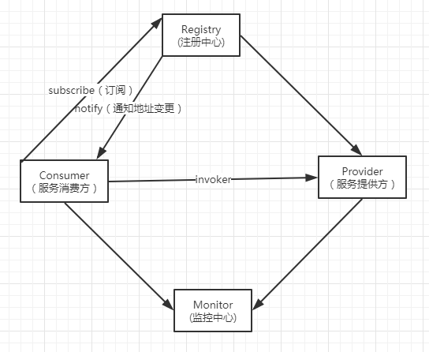
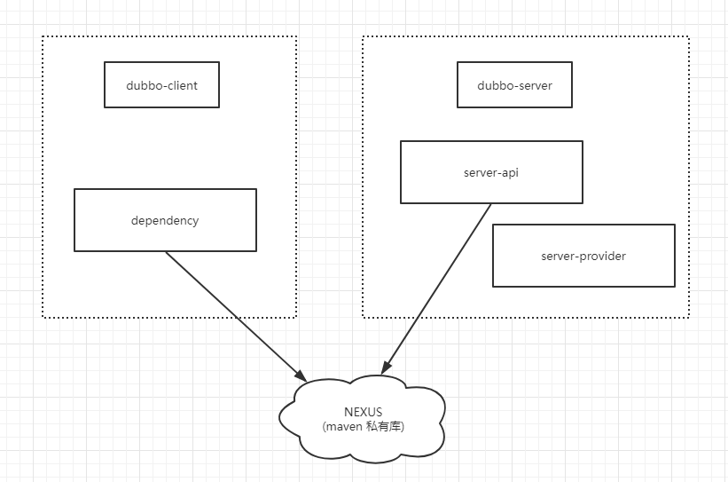
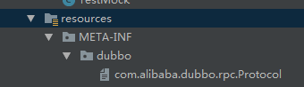
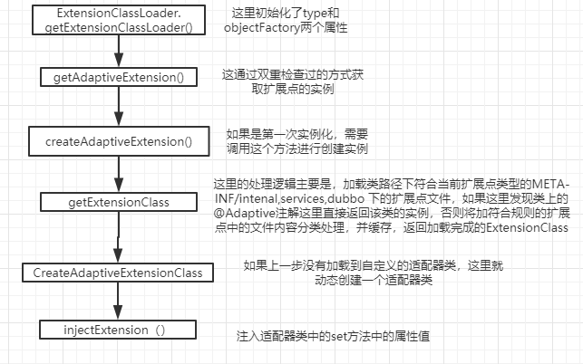

#### 1、dubbo的整体架构

如下图所示，包含注册中心，监控中心，服务消费方，服务提供方四大组件



其中服务消费方和注册中心利用zookeeper订阅，通知订阅更新的一个机制实现了服务的发现

consumer和provider通过invoker机制通过netty进行nio通信。

#### 2、dubbo案例演示



这里介绍了dubbo的一个常用案例，一般是服务提供方(dubbo-server)将server-api发布到私有库，

然后服务消费方（dubbo-client）从私有库中获取这个依赖，然后进行服务的远程调用

#### 3、dubbo的一些特性

- 多协议支持

  **支持发布多个协议**

- 多版本支持

  通过在provider和consumer配置文件中配置服务版本来获得多版本支持的功能，具体配置如下

  consumer配置

  ```xml
  <!-- 生成远程服务代理，可以和本地bean一样使用demoService -->
      <dubbo:reference id="demoService" interface="service.SayHelloService" version="1.0.1" />
  ```

  provider配置

  ```xml
   <!-- 声明需要暴露的服务接口 -->
      <dubbo:service interface="service.SayHelloService" ref="demoService" version="1.0.0"/>
      <dubbo:service interface="service.SayHelloService" ref="demoService" version="1.0.1"/>
  ```

  这里provider配置了统一服务的两个实现，版本号分别为 1.0.0和1.0.1 

  consumer配置了所需调用的版本号 1.0.1

- 主机绑定

  dubbo获取需要发布的主机地址的时候有这样几种方式，对应的获取代码在`ServerConfig`类中的`doExportUrlsFor1Protocol()`方法中

  1.通过配置文件获取

  ```xml
  <!-- 用dubbo协议在20880端口暴露服务 -->
      <dubbo:protocol name="dubbo" port="20880"  host="192.168.1.1"/>
  ```

  对饮代码片段

  ```java
    //通过配置文件获取发布IP
          String host = protocolConfig.getHost();
  
          /**
           * @Parameter(excluded = true)
              public String getHost() {
                  return host;
              }
           */
  ```


  2、通过本地网卡获取

  - 在没有配置host的情况下，或者配置文件中配置的IP地址无效的情况下，dubbo会从本地网卡获取发布地址

  对应的代码片段

  ```java
  try {
                  host = InetAddress.getLocalHost().getHostAddress();
              } catch (UnknownHostException e) {
                  logger.warn(e.getMessage(), e);
              }
  ```

  3、通过注册中心获取

  - 如果获取地址仍然失败，dubbo会从注册中心获取地址，方法是尝试通过socket方式连接注册中心

    如果有一个注册中心连接成功，通过连接成功的socket获取的当前ip

  对应的代码片段

  ```java
  if (registryURLs != null && registryURLs.size() > 0) {
      //循环注册中心，尝试以socket方式与注册中心进行连接，获取ip
                      for (URL registryURL : registryURLs) {
                          try {
                              Socket socket = new Socket();
                              try {
                                  SocketAddress addr = new 		InetSocketAddress(registryURL.getHost(), registryURL.getPort());
                                  socket.connect(addr, 1000);
                                  host = socket.getLocalAddress().getHostAddress();
                                  break;
                              } finally {
                                  try {
                                      socket.close();
                                  } catch (Throwable e) {}
                              }
                          } catch (Exception e) {
                              logger.warn(e.getMessage(), e);
                          }
                      }
                  }
  ```

- 服务容错

  dubbo提供了6中服务容错机制

  ```xml
   <!-- 声明需要暴露的服务接口 -->
      <dubbo:service interface="service.SayHelloService" ref="demoService" version="1.0.0"
          cluster="failover"
      /> //服务端配置
  <!-- 生成远程服务代理，可以和本地bean一样使用demoService -->
      <dubbo:reference id="demoService" interface="service.SayHelloService" version="1.0.1" 
          cluster="failover"
      />//客户端配置
  ```


  - failsafe 

    - 失败安全机制，当远程调用失败时，客户端会吞掉错误
    - 失败安全，出现异常时，直接忽略。通常用于写入审计日志等操作。 

  - failover

    - 失败重试机制，当远程调用失败时，客户端会进行默认2次的重试，重试仍然失败的情况下会调用dubbo的mock机制（服务降级策略，可能返回一个错误页面），这个机制是dubbo的默认容错机制

      默认重试次数是2次，加上本来的1次调用共3次调用机会

    - 失败自动切换，当出现失败，重试其它服务器 [[1\]](http://dubbo.apache.org/zh-cn/docs/user/demos/fault-tolerent-strategy.html#fn1)。通常用于读操作，但重试会带来更长延迟。可通过 `retries="2"` 来设置重试次数(不含第一次)。 

  ```xml
  <dubbo:service retries="2" />//服务端配置
  <dubbo:reference retries="2" />//客户端配置
  <dubbo:reference>
      <dubbo:method name="findFoo" retries="2" /> //方法配置
  </dubbo:reference>
  ```


  - failfast
    - 立即失败机制，远程调用失败时立即返回错误
    - 快速失败，只发起一次调用，失败立即报错。通常用于非幂等性的写操作，比如新增记录。 
  - failback
    - 失败回滚机制，
    - 失败自动恢复，后台记录失败请求，定时重发。通常用于消息通知操作。 
  - fork
    - 设置一个并行数，同时允许客户端调用多个统一服务的多个发布地址，有1个返回成功即可
    - 并行调用多个服务器，只要一个成功即返回。通常用于实时性要求较高的读操作，但需要浪费更多服务资源。可通过 `forks="2"` 来设置最大并行数。 

  ```xml
  
  ```


  - broadcast
    - 广播机制，调用服务的多个发布地址，任意一台报错，返回报错	
    - 广播调用所有提供者，逐个调用，任意一台报错则报错 [[2\]](http://dubbo.apache.org/zh-cn/docs/user/demos/fault-tolerent-strategy.html#fn2)。通常用于通知所有提供者更新缓存或日志等本地资源信息。 

- 服务降级

  服务降级可以分为手动降级和自动降级  按照功能类型分为 读服务降级和写服务降级

  1、对于一些非主流程进行人工降级，例如在大促之前关闭一些对主流程没有影响的功能，例如

  推荐，评价功能。

  2、故障降级，远程调用出现故障的时候，例如 网络故障，远程调用失败等。这时可采用设置默认值或者兜底数据的方式（系统推荐的行为广告挂了，可以提前准备静态页面做返回）等等 

  3、限流降级，在秒杀这种流量比较集中并且流量特别大的情况下，因为突发访问量特别大可能会导致系统支撑不了。这个时候可以采用限流来限制访问量。当达到阀值时，后续的请求被降级，比如进入排队页面，比如跳转到错误页（活动太火爆，稍后重试等） 

  4、dubbo 实现方式 

  - 编写一个Mock类实现需要降级的接口，必须以mock结尾，例如TestMock
  - 在配置文件中配置上这个接口

  ```xml
  <dubbo:reference id="demoService" interface="service.SayHelloService" timeout="1"
                       version="1.0.1" mock="TestMock">//服务调用失败后调用的mock类
      </dubbo:reference>
  ```

- 配置的有限级别

  - 总体规则 消费方优先于服务方
  - 优先级别由高到低分别为 方法 接口（服务） 全局配置
  - 如果级别一样消费方优先，服务提供方次之

   建议由服务提供方设置超时，因为一个方法需要执行多长时间，服务提供方更清楚，如果一个消费方同时引用多个服务，就不需要关心每个服务的超时设置。 

- SPI机制（service provider interface）

  - Java的SPI机制

    实现案例，Java的Driver类的实现基于SPI机制，Driver的实现类有

    各个数据库厂商的实现，例如Mysql Oracle 

    实现步骤

    1. 在classpath下创建META-INF/services目录
    2. 在该目录下创建文件，该文件名必须为要扩展接口的全路径，文件内部描述是扩展该接口的所有时间类
    3. 文件编码必须为UTF-8
    4. 通过java.util.serviceLoder的加载机制发现

  - Java SPI的缺点

    - 会一次性加载META-INF/services文件中的所有实现类，如果有一些类没有用到 浪费资源

  - Dubbo基于SPI思想的实现

    1. 需要在resource目录下配置META-INF/dubbo或者META-INF/dubbo/internal或者META-INF/services，并基于SPI接口去创建一个文件

    2. 文件名称和接口名称保持一致，文件内容和SPI有差异，内容是KEY对应Value

  实现细节

  ```java
  //1.实现dubbo扩展点
  public class DefinitionProtocol implements Protocol{
      public int getDefaultPort() {
          return 9999;
      }
  
      public <T> Exporter<T> export(Invoker<T> invoker) throws RpcException {
          return null;
      }
  
      public <T> Invoker<T> refer(Class<T> aClass, URL url) throws RpcException {
          return null;
      }
  
      public void destroy() {
  
      }
  }
  ```

  2. 配置spi文件

     

  3. 调用

     ```java
     Protocol protocol = ExtensionLoader.getExtensionLoader(Protocol.class).getExtension("myProtocol");
     System.out.println(protocol.getDefaultPort());
     
     //输出结果 9999
     
     ```

#### Dubbo源码解析

- 自适应扩展点

  - 源码分析入口

    ```java
    //这段代码在获取一个自适应的扩展点
            Protocol protocol1 =
                    ExtensionLoader.getExtensionLoader(Protocol.class).getAdaptiveExtension();
    ```


    - 这段代码可以分为两个阶段去解读
    
      - 第一个阶段 `ExtensionLoader.getExtensionLoader(Protocol.class)`这里根据传入的类型获取了一个`ExtensionLoder` 类似于工厂模式
    
      - 第二个阶段 根据`ExtensionLoder.getAdaptiveExtension()`获取一个自适应的扩展点。

  - 第一阶段 `ExtensionLoader.getExtensionLoader(Protocol.class)`方法源码如下

    ```java
    public static <T> ExtensionLoader<T> getExtensionLoader(Class<T> type) {
            if (type == null) //如果传入的类型为空 
                throw new IllegalArgumentException("Extension type == null");
            if (!type.isInterface()) {//如果传入的类型不是接口
                throw new IllegalArgumentException("Extension type(" + type + ") is not interface!");
            }
            if (!withExtensionAnnotation(type)) {//如果传入的类没有@SPI注解
                throw new IllegalArgumentException("Extension type(" + type +
                        ") is not extension, because WITHOUT @" + SPI.class.getSimpleName() + " Annotation!");
            }
    		//先从缓存中获取ExtensionLoader
            ExtensionLoader<T> loader = (ExtensionLoader<T>) EXTENSION_LOADERS.get(type);
            //如果获取不到手动创建一个ExtensionLoader并且放入缓存
        	if (loader == null) {
                //这里在获取ExtensionLoader的过程中 对objectFactory属性进行了赋值
                //赋值逻辑为objectFactory = (type == ExtensionFactory.class ? null : //ExtensionLoader.getExtensionLoader(ExtensionFactory.class).getAdaptiveExtensio//n()); 这里获取的是一个自定义的扩展点  //AdaptiveExtensionFactory
                EXTENSION_LOADERS.putIfAbsent(type, new ExtensionLoader<T>(type));
                loader = (ExtensionLoader<T>) EXTENSION_LOADERS.get(type);
            }
            return loader;
        }
    ```

    分析这个方法得知：首先传入这个方法的参数（类）必须不为空 且必须是有@SPI注解的接口

    首先会从缓存中区获得ExtensionLoader 如果获取不到，在自行创建一个，并且放入缓存，存储ExtensionLoader的缓存如下

    ```java
    private static final ConcurrentMap<Class<?>, ExtensionLoader<?>> EXTENSION_LOADERS = new ConcurrentHashMap<Class<?>, ExtensionLoader<?>>();
    ```

    可以看出这个缓存是key为传入的Class value为对应的 ExtensionLoader，这里还可以看出在dubbo中每一个扩展点都会对应一个ExtensionLoder。

  - 第二阶段`ExtensionLoder.getAdaptiveExtension()`方法如下

    ```java
    public T getAdaptiveExtension() {
        	//首先也是从缓存中去取自适应的扩展点
            Object instance = cachedAdaptiveInstance.get();
            //这里用双重检查锁的方式获取自适应扩展点的实例
        	if (instance == null) {
                if (createAdaptiveInstanceError == null) {
                    synchronized (cachedAdaptiveInstance) {
                        instance = cachedAdaptiveInstance.get();
                        if (instance == null) {
                            try {
                                //创建动态自适应扩展点
                                instance = createAdaptiveExtension();
                                //放入缓存
                                cachedAdaptiveInstance.set(instance);
                            } catch (Throwable t) {
                                createAdaptiveInstanceError = t;
                                throw new IllegalStateException("fail to create adaptive instance: " + t.toString(), t);
                            }
                        }
                    }
                } else {
                    throw new IllegalStateException("fail to create adaptive instance: " + createAdaptiveInstanceError.toString(), createAdaptiveInstanceError);
                }
            }
    
            return (T) instance;
        }
    ```

    沿着第二阶段的思路找到了` createAdaptiveExtension()`这个方法

    看一下这个方法的实现

    ```java
    //私有方法
    private T createAdaptiveExtension() {
            try {
                //看方法名称的意思是依赖注入了一个自适应扩展点的实例
                //内层getAdaptiveExtensionClass()这个方法获取了一个自适应扩展点的class
                //下面就getAdaptiveExtensionClass()这个方法进行分析
                //private final ExtensionFactory objectFactory;
                //具体依赖注入的原则是首先获得该实例set开头的方法，从ObjectFactory中查找对应的对			    //象并进行注入
                return injectExtension((T) getAdaptiveExtensionClass().newInstance());
            } catch (Exception e) {
                throw new IllegalStateException("Can not create adaptive extension " + type + ", cause: " + e.getMessage(), e);
            }
        }
    ```


    `getAdaptiveExtensionClass()`方法内容如下
    
    ```java
    //私有方法
    private Class<?> getAdaptiveExtensionClass() {
        	//获取了一次扩展类
            getExtensionClasses();
        	//如果获取到了 这里就返回了 
            if (cachedAdaptiveClass != null) {
                return cachedAdaptiveClass;
            }
        	//没有获取到,通过createAdaptiveExtensionClass()创建
            return cachedAdaptiveClass = createAdaptiveExtensionClass();
        }
    ```
    
    分析一下`getExtensionClasses();`方法内容
    
    ```java
    //私有方法
    private Map<String, Class<?>> loadExtensionClasses() {
            final SPI defaultAnnotation = type.getAnnotation(SPI.class);
        //检查了一下@SPI注解上的value值 在不唯一的情况下抛出异常
        //如果检查通过 将此值赋给cachedDefaultName
            if (defaultAnnotation != null) {
                String value = defaultAnnotation.value();
                if ((value = value.trim()).length() > 0) {
                    String[] names = NAME_SEPARATOR.split(value);
                    if (names.length > 1) {
                        throw new IllegalStateException("more than 1 default extension name on extension " + type.getName()
                                + ": " + Arrays.toString(names));
                    }
                    if (names.length == 1) cachedDefaultName = names[0];
                }
            }
    
            Map<String, Class<?>> extensionClasses = new HashMap<String, Class<?>>();
        	//2.6.2中将2.5.4中的loadFile方法拆分了 
            loadDirectory(extensionClasses, DUBBO_INTERNAL_DIRECTORY);
            loadDirectory(extensionClasses, DUBBO_DIRECTORY);
            loadDirectory(extensionClasses, SERVICES_DIRECTORY);
            return extensionClasses;
        }
    ```
    
    下面分析一下`loadDirectory`方法，其方法内容如下
    
    ```java
    //私有方法
        private void loadDirectory(Map<String, Class<?>> extensionClasses, String dir) {
            //这里filename 形如META-INF/services/com.alibaba.dubbo.rpc.Protocol
            String fileName = dir + type.getName();
            try {
                Enumeration<java.net.URL> urls;
                ClassLoader classLoader = findClassLoader();
                //根据fileName加载urls值
                if (classLoader != null) {
                    urls = classLoader.getResources(fileName);
                } else {
                    urls = ClassLoader.getSystemResources(fileName);
                }
                //如果加载到 调用loadResource方法加载该资源
                if (urls != null) {
                    while (urls.hasMoreElements()) {
                        java.net.URL resourceURL = urls.nextElement();
                        loadResource(extensionClasses, classLoader, resourceURL);
                    }
                }
            } catch (Throwable t) {
                logger.error("Exception when load extension class(interface: " +
                        type + ", description file: " + fileName + ").", t);
            }
        }
    ```
    
    在`loadResource`方法中调用`loadClass（）`方法加载改文件中的所有类
    
    该文件的内容一般为
    
    ```properties
    filter=com.alibaba.dubbo.rpc.protocol.ProtocolFilterWrapper
    listener=com.alibaba.dubbo.rpc.protocol.ProtocolListenerWrapper
    mock=com.alibaba.dubbo.rpc.support.MockProtocol
    dubbo=com.alibaba.dubbo.rpc.protocol.dubbo.DubboProtocol
    injvm=com.alibaba.dubbo.rpc.protocol.injvm.InjvmProtocol
    rmi=com.alibaba.dubbo.rpc.protocol.rmi.RmiProtocol
    hessian=com.alibaba.dubbo.rpc.protocol.hessian.HessianProtocol
    com.alibaba.dubbo.rpc.protocol.http.HttpProtocol
    com.alibaba.dubbo.rpc.protocol.webservice.WebServiceProtocol
    thrift=com.alibaba.dubbo.rpc.protocol.thrift.ThriftProtocol
    memcached=com.alibaba.dubbo.rpc.protocol.memcached.MemcachedProtocol
    redis=com.alibaba.dubbo.rpc.protocol.redis.RedisProtocol
    rest=com.alibaba.dubbo.rpc.protocol.rest.RestProtocol
    registry=com.alibaba.dubbo.registry.integration.RegistryProtocol
    qos=com.alibaba.dubbo.qos.protocol.QosProtocolWrapper
    
    ```


    ```java
    private void loadResource(Map<String, Class<?>> extensionClasses, ClassLoader classLoader, java.net.URL resourceURL) {
            try {
                BufferedReader reader = new BufferedReader(new InputStreamReader(resourceURL.openStream(), "utf-8"));
                try {
                    String line;
                    //这里读取文件中的每一行记录
                    while ((line = reader.readLine()) != null) {
                        final int ci = line.indexOf('#');
                        if (ci >= 0) line = line.substring(0, ci);
                        line = line.trim();
                        if (line.length() > 0) {
                            try {
                                String name = null;
                                int i = line.indexOf('=');
                                if (i > 0) {
                                    name = line.substring(0, i).trim();
                                    //这里line形如com.alibaba.dubbo.rpc.protocol.ProtocolFilterWrapper
                                    line = line.substring(i + 1).trim();
                                }
                                if (line.length() > 0) {
                                    //调用方法处理读取的类全名
                                    loadClass(extensionClasses, resourceURL, Class.forName(line, true, classLoader), name);
                                }
                            } catch (Throwable t) {
                                IllegalStateException e = new IllegalStateException("Failed to load extension class(interface: " + type + ", class line: " + line + ") in " + resourceURL + ", cause: " + t.getMessage(), t);
                                exceptions.put(line, e);
                            }
                        }
                    }
                } finally {
                    reader.close();
                }
            } catch (Throwable t) {
                logger.error("Exception when load extension class(interface: " +
                        type + ", class file: " + resourceURL + ") in " + resourceURL, t);
            }
        }
    ```
    
    下面分析`loadClass()`这个方法
    
    ```java
     private void loadClass(Map<String, Class<?>> extensionClasses, java.net.URL resourceURL, Class<?> clazz, String name) throws NoSuchMethodException {
         //判断传进来的类是否是该扩展点的实现，如果不是就报错
            if (!type.isAssignableFrom(clazz)) {
                throw new IllegalStateException("Error when load extension class(interface: " +
                        type + ", class line: " + clazz.getName() + "), class "
                        + clazz.getName() + "is not subtype of interface.");
            }
         //这里判断@Adaptive注解是否是在类上，如果在类上的话，直接将该类赋值给cachedAdaptiveClass 并结束该流程，这里证明查询到的类是自定义的适配器类，就不走下面的自动生成动态适配器类的逻辑了
            if (clazz.isAnnotationPresent(Adaptive.class)) {
                if (cachedAdaptiveClass == null) {
                    cachedAdaptiveClass = clazz;
                } else if (!cachedAdaptiveClass.equals(clazz)) {
                    throw new IllegalStateException("More than 1 adaptive class found: "
                            + cachedAdaptiveClass.getClass().getName()
                            + ", " + clazz.getClass().getName());
                }
                //判断下是否是包装类 判断方式为 是否存在一个 参数为 type的构造器
                //如果存在 将该类缓存到cachedWrapperClasses
            } else if (isWrapperClass(clazz)) {
                Set<Class<?>> wrappers = cachedWrapperClasses;
                if (wrappers == null) {
                    cachedWrapperClasses = new ConcurrentHashSet<Class<?>>();
                    wrappers = cachedWrapperClasses;
                }
                wrappers.add(clazz);
            } else {
                clazz.getConstructor();
                //这里好像没有啥用处了，@Extension注解已经被废弃了
                if (name == null || name.length() == 0) {
                    name = findAnnotationName(clazz);
                    if (name.length() == 0) {
                        throw new IllegalStateException("No such extension name for the class " + clazz.getName() + " in the config " + resourceURL);
                    }
                }
                String[] names = NAME_SEPARATOR.split(name);
                //这里判断是否是一个自动激活的扩展点
                if (names != null && names.length > 0) {
                    Activate activate = clazz.getAnnotation(Activate.class);
                    if (activate != null) {
                        cachedActivates.put(names[0], activate);
                    }
                 //缓存 格式 类似key=com.alibaba.dubbo.rpc.protocol.rmi.RmiProtocol
                   // value=rmi
                    for (String n : names) {
                        if (!cachedNames.containsKey(clazz)) {
                            cachedNames.put(clazz, n);
                        }
                        //这里放入extensionClasses
                        Class<?> c = extensionClasses.get(n);
                        if (c == null) {
                            extensionClasses.put(n, clazz);
                        } else if (c != clazz) {
                            throw new IllegalStateException("Duplicate extension " + type.getName() + " name " + n + " on " + c.getName() + " and " + clazz.getName());
                        }
                    }
                }
            }
        }
    ```


    到这里就调用完成了。总结一下调用过程




- 服务的发布和注册过程

  dubbo扩展了spring `BeanDefinitionParser``NamespaceHandlerSupport`两个接口实现了基于spring的xml文件解析

  xml文件的解析结果存放于 `ServiceConfig`和`ReferenceConfig`类

  - 服务发布的入口

    serviceBean集成自ServiceConfig 并实现了Spring中的InitializingBean, DisposableBean, ApplicationContextAware, ApplicationListener, BeanNameAware的五个接口

    在serviceBean中重写了InitializingBean中的afterPropertiesSet，这个方法在springBean初始化完成后会被调用。在这个方法的最会调用了SreviceConfig类中的export(); 所以服务发布的入口从这里开始。

    下面是export()方法的内容

    ```java
    //这是一个同步方法
    public synchronized void export() {
            if (provider != null) {
                if (export == null) {
                    export = provider.getExport();
                }
                if (delay == null) {
                    delay = provider.getDelay();
                }
            }
            if (export != null && ! export.booleanValue()) {
                return;
            }
        //延迟启动简单粗暴 直接线程sleep搞定，无论是否delay 都会调用doExport();方法
            if (delay != null && delay > 0) {
                Thread thread = new Thread(new Runnable() {
                    public void run() {
                        try {
                            Thread.sleep(delay);
                        } catch (Throwable e) {
                        }
                        doExport();
                    }
                });
                thread.setDaemon(true);
                thread.setName("DelayExportServiceThread");
                thread.start();
            } else {
                doExport();
            }
        }
    ```

    下面看一下`doExport();`方法的部分内容

    ```java
    protected synchronized void doExport() {
           .........more code
               //在方法的最后调用了这个方法
            doExportUrls();
        }
    ```

    `doExportUrls();`

    ```java
     private void doExportUrls() {
            List<URL> registryURLs = loadRegistries(true);//获得注册中心的配置
            for (ProtocolConfig protocolConfig : protocols) { //支持多协议发布
                //这里循环去发布多个协议
                doExportUrlsFor1Protocol(protocolConfig, registryURLs);
            }
        }
    ```

    `doExportUrlsFor1Protocol`

    ```java
    //通过proxyFactory来获取Invoker对象
    Invoker<?> invoker = proxyFactory.getInvoker(ref, (Class) interfaceClass, registryURL.addParameterAndEncoded(Constants.EXPORT_KEY, url.toFullString()));
    //注册服务,
    Exporter<?> exporter = protocol.export(invoker);
    //将exporter添加到list中
    exporters.add(exporter);
    ```

    代码中protocol是一个动态适配器 其定义如下

    ```java
    private static final Protocol protocol = ExtensionLoader.
                getExtensionLoader(Protocol.class).
                getAdaptiveExtension(); //Protocol$Adaptive
    ```

    由上面的代码分析可知此处protocol是一个名为Protocol$Adaptive的动态适配器

    这里调用的是Protocol$Adaptive中的export方法，传入的参数为 invoker 此处得到的是服务的发布地址协议 invoker中的Url协议头为registry，由Protocol$Adaptive中export方法中调用逻辑为

    ```java
    ExtensionLoader.getExtensionLoader(Protocol.class).getExtension("registry").export();
    ```

    这里调用的是 RegistryProtocol中的export方法

    **这里分析一下这个方法`ExtensionLoader.getExtensionLoader(Protocol.class).getExtension("registry")`**

    `getExtension()`中的`createExtension(name)`主要看一下这个方法的实现

    ```java
    private T createExtension(String name) {
        //这里在缓中去扩展点的class
            Class<?> clazz = getExtensionClasses().get(name);//"dubbo"  clazz=DubboProtocol
            if (clazz == null) {
                throw findException(name);
            }
            try {
                //将扩展点的实例放入缓存
                T instance = (T) EXTENSION_INSTANCES.get(clazz);
                if (instance == null) {
                    EXTENSION_INSTANCES.putIfAbsent(clazz, (T) clazz.newInstance());
                    instance = (T) EXTENSION_INSTANCES.get(clazz);
                }
                injectExtension(instance);
                //这里讲获得的扩展点循环装饰 例如 filterWrapper(listenerWrapper(扩展点))
                Set<Class<?>> wrapperClasses = cachedWrapperClasses;
                if (wrapperClasses != null && wrapperClasses.size() > 0) {
                    for (Class<?> wrapperClass : wrapperClasses) {
                        instance = injectExtension((T) wrapperClass.getConstructor(type).newInstance(instance));
                    }
                }
                return instance;
            } catch (Throwable t) {
                throw new IllegalStateException("Extension instance(name: " + name + ", class: " +
                        type + ")  could not be instantiated: " + t.getMessage(), t);
            }
        }
    ```


    ```java
    public <T> Exporter<T> export(final Invoker<T> originInvoker) throws RpcException {
            //export invoker 暴露服务的方法
            final ExporterChangeableWrapper<T> exporter = doLocalExport(originInvoker);
            //registry provider 注册服务的方法
            final Registry registry = getRegistry(originInvoker);
            //得到需要注册到zk上的协议地址，也就是dubbo://
            final URL registedProviderUrl = getRegistedProviderUrl(originInvoker);
            registry.register(registedProviderUrl);
            // 订阅override数据
            // FIXME 提供者订阅时，会影响同一JVM即暴露服务，又引用同一服务的的场景，因为subscribed以服务名为缓存的key，导致订阅信息覆盖。
            final URL overrideSubscribeUrl = getSubscribedOverrideUrl(registedProviderUrl);
            final OverrideListener overrideSubscribeListener = new OverrideListener(overrideSubscribeUrl);
            overrideListeners.put(overrideSubscribeUrl, overrideSubscribeListener);
            registry.subscribe(overrideSubscribeUrl, overrideSubscribeListener);
            //保证每次export都返回一个新的exporter实例
            return new Exporter<T>() {
                public Invoker<T> getInvoker() {
                    return exporter.getInvoker();
                }
                public void unexport() {
                	try {
                		exporter.unexport();
                	} catch (Throwable t) {
                    	logger.warn(t.getMessage(), t);
                    }
                    try {
                    	registry.unregister(registedProviderUrl);
                    } catch (Throwable t) {
                    	logger.warn(t.getMessage(), t);
                    }
                    try {
                    	overrideListeners.remove(overrideSubscribeUrl);
                    	registry.unsubscribe(overrideSubscribeUrl, overrideSubscribeListener);
                    } catch (Throwable t) {
                    	logger.warn(t.getMessage(), t);
                    }
                }
            };
        }
    ```

    `doLocalExport`

    ```java
     private <T> ExporterChangeableWrapper<T>  doLocalExport(final Invoker<T> originInvoker){
            String key = getCacheKey(originInvoker);
            ExporterChangeableWrapper<T> exporter = (ExporterChangeableWrapper<T>) bounds.get(key);
            if (exporter == null) {
                synchronized (bounds) {
                    exporter = (ExporterChangeableWrapper<T>) bounds.get(key);
                    if (exporter == null) {
                        final Invoker<?> invokerDelegete = new InvokerDelegete<T>(originInvoker, getProviderUrl(originInvoker));
    //在这里暴露服务
    exporter = new ExporterChangeableWrapper<T((Exporter<T>)protocol.export(invokerDelegete), originInvoker);
                        bounds.put(key, exporter);
                    }
                }
            }
            return (ExporterChangeableWrapper<T>) exporter;
        }
    ```

    分析下暴露服务的protocol

    ```java
    private Protocol protocol;
    
    public void setProtocol(Protocol protocol) {
        this.protocol = protocol;
    }
    
    ```

    这里的protocol 应该是初始化时自动注入的，根据dubbo获取扩展点的规则，这里注入的对象应该为

    protocol$adaptive,传入的invokerDelegete为dubbo开头的协议，所以这个方法应该最终调用的是DubboProtocol，但是由于这里在getExtension(name)中会经过包装，这里的实际对象应该为

    ProtocolFilterWrapper(ProtocolListenerWrapper(DubboProtocol)),这里是一个链式调用，首先会经过FilterWrapper的处理，其次经过ListenerWrapper的处理，最后在调用DubboProtocol的export方法。

    FilterWrapper中有很多Filter的扩展点，通过filter增加了很多dubbo服务调用时的非业务性功能

    ```properties
    echo=com.alibaba.dubbo.rpc.filter.EchoFilter
    generic=com.alibaba.dubbo.rpc.filter.GenericFilter
    genericimpl=com.alibaba.dubbo.rpc.filter.GenericImplFilter
    token=com.alibaba.dubbo.rpc.filter.TokenFilter
    accesslog=com.alibaba.dubbo.rpc.filter.AccessLogFilter
    activelimit=com.alibaba.dubbo.rpc.filter.ActiveLimitFilter
    classloader=com.alibaba.dubbo.rpc.filter.ClassLoaderFilter
    context=com.alibaba.dubbo.rpc.filter.ContextFilter
    consumercontext=com.alibaba.dubbo.rpc.filter.ConsumerContextFilter
    exception=com.alibaba.dubbo.rpc.filter.ExceptionFilter
    executelimit=com.alibaba.dubbo.rpc.filter.ExecuteLimitFilter
    deprecated=com.alibaba.dubbo.rpc.filter.DeprecatedFilter
    compatible=com.alibaba.dubbo.rpc.filter.CompatibleFilter
    timeout=com.alibaba.dubbo.rpc.filter.TimeoutFilter
    ```

    ListenerWrapper有一个过滤废弃服务的实现,通过判断dubbo配置参数上的deprecated**标记实现**

    ```properties
    deprecated=com.alibaba.dubbo.rpc.listener.DeprecatedInvokerListener
    ```

    `DubboProtocol中的`export()

  ```java
  public <T> Exporter<T> export(Invoker<T> invoker) throws RpcException {
          URL url = invoker.getUrl();
          
          // export service.
          String key = serviceKey(url);
          DubboExporter<T> exporter = new DubboExporter<T>(invoker, key, exporterMap);
          exporterMap.put(key, exporter);
  
          //export an stub service for dispaching event
          Boolean isStubSupportEvent = url.getParameter(Constants.STUB_EVENT_KEY,Constants.DEFAULT_STUB_EVENT);
          Boolean isCallbackservice = url.getParameter(Constants.IS_CALLBACK_SERVICE, false);
          if (isStubSupportEvent && !isCallbackservice){
              String stubServiceMethods = url.getParameter(Constants.STUB_EVENT_METHODS_KEY);
              if (stubServiceMethods == null || stubServiceMethods.length() == 0 ){
                  if (logger.isWarnEnabled()){
                      logger.warn(new IllegalStateException("consumer [" +url.getParameter(Constants.INTERFACE_KEY) +
                              "], has set stubproxy support event ,but no stub methods founded."));
                  }
              } else {
                  stubServiceMethodsMap.put(url.getServiceKey(), stubServiceMethods);
              }
          }
  		
      //这里启动服务，默认Netty方式
          openServer(url);
          
          return exporter;
      }
  ```
